# 🤖 Gerador de Conteúdo - Labs Didáticos de DevOps e Engenharia de Plataforma

[](https://opensource.org/licenses/MIT)
[](https://github.com/features/copilot)

Sistema completo de multi-agentes para GitHub Copilot que gera **labs didáticos de alta qualidade** na área de Engenharia de Plataforma e DevOps. O sistema é composto por 5 agentes especializados que trabalham de forma coordenada para criar conteúdo técnico atualizado, preciso e didático.

---

## 📋 Índice

- [Visão Geral](#-visão-geral)
- [Arquitetura do Sistema](#-arquitetura-do-sistema)
- [Agentes do Sistema](#-agentes-do-sistema)
- [Estrutura de Diretórios](#-estrutura-de-diretórios)
- [Como Usar](#-como-usar)
- [Como Funciona o Workflow](#-como-funciona-o-workflow)
- [Customização de Templates](#-customização-de-templates)
- [Exemplos de Temas](#-exemplos-de-temas)
- [Troubleshooting](#-troubleshooting)
- [Contribuição](#-contribuição)
- [Licença](#-licença)

---

## 🎯 Visão Geral

Este projeto utiliza a tecnologia de agentes do GitHub Copilot para automatizar a criação de laboratórios didáticos. O sistema garante que todo o conteúdo gerado:

- ✅ Utiliza **versões LATEST** das tecnologias
- ✅ Segue uma **estrutura padronizada** e profissional
- ✅ Possui **comandos atualizados** e testáveis
- ✅ Inclui **explicações didáticas** claras
- ✅ Passa por **revisão automatizada** de qualidade
- ✅ Usa apenas **fontes oficiais** e verificadas

---

## 🏗️ Arquitetura do Sistema

```mermaid
graph TD
    User[👤 Usuário] -->|Solicita Lab| Orch[🎯 Orquestrador de Labs]
    Orch -->|1. Lê Template| Reader[📖 Leitor de Template]
    Orch -->|2. Pesquisa Docs| Researcher[🔍 Pesquisador de Docs]
    Orch -->|3. Gera Conteúdo| Generator[✍️ Gerador de Lab]
    Orch -->|4. Revisa| Reviewer[👨‍⚖️ Revisor de Lab]
    
    Reader -->|Estrutura| Research[(📁 Pesquisa)]
    Researcher -->|Briefing| Research
    Generator -->|Lab v1| Drafts[(📝 Rascunhos)]
    Reviewer -->|Relatório| Reviews[(📊 Revisões)]
    
    Reviewer -->|❌ Reprovado| Generator
    Reviewer -->|✅ Aprovado| Output[(📄 Output Final)]
    
    Generator -.->|Máx 3 ciclos| Reviewer
    
    style Orch fill:#4CAF50,stroke:#333,stroke-width:4px,color:#fff
    style User fill:#2196F3,stroke:#333,stroke-width:2px,color:#fff
    style Output fill:#FF9800,stroke:#333,stroke-width:2px,color:#fff
```



### Fluxo de Trabalho

1. **Usuário** invoca o orquestrador com um tema
2. **Leitor de Template** analisa a estrutura obrigatória
3. **Pesquisador de Docs** busca informações técnicas atualizadas
4. **Gerador de Lab** cria o conteúdo seguindo o template
5. **Revisor de Lab** valida qualidade, estrutura e precisão técnica
6. **Ciclo de Revisão** (até 3 iterações se necessário)
7. **Entrega Final** do lab aprovado

---

## 🤖 Agentes do Sistema

| Agente | Papel | Model | Tools | Invocável |
|--------|-------|-------|-------|-----------|
| **🎯 Orquestrador de Labs** | Coordena todo o workflow e gerencia os agentes | Default | agent, read, edit | ✅ Sim |
| **📖 Leitor de Template** | Analisa e interpreta templates de labs | Default | read | ❌ Não |
| **🔍 Pesquisador de Docs** | Busca informações técnicas atualizadas | Sonnet 4.5 | read, search, fetch | ❌ Não |
| **✍️ Gerador de Lab** | Cria o conteúdo didático do lab | Opus 4.6 | read, edit | ❌ Não |
| **👨‍⚖️ Revisor de Lab** | Valida qualidade e conformidade | Sonnet 4.5 | read | ❌ Não |

### Descrição Detalhada dos Agentes

#### 🎯 Orquestrador de Labs
- **Responsabilidade**: Gerenciar todo o ciclo de vida da geração do lab
- **Funções**:
  - Receber tema do usuário
  - Criar estrutura de diretórios
  - Chamar agentes na ordem correta
  - Gerenciar ciclos de revisão (máximo 3)
  - Entregar resultado final
- **Como invocar**: `@orquestrador-de-labs Crie um lab sobre {tema}`

#### 📖 Leitor de Template
- **Responsabilidade**: Interpretar a estrutura dos templates
- **Funções**:
  - Ler arquivos de template em `workspace/templates/`
  - Identificar seções obrigatórias e ordem
  - Extrair campos e formatação esperada
  - Gerar resumo estruturado da template

#### 🔍 Pesquisador de Docs
- **Responsabilidade**: Garantir informações técnicas atualizadas
- **Funções**:
  - Identificar tecnologias do tema
  - Buscar versões LATEST em fontes oficiais
  - Extrair comandos, APIs e configurações atualizadas
  - Compilar briefing de pesquisa com referências

#### ✍️ Gerador de Lab
- **Responsabilidade**: Criar o conteúdo didático de qualidade
- **Funções**:
  - Seguir estrutura exata do template
  - Usar apenas informações do briefing de pesquisa
  - Criar passos progressivos e didáticos
  - Incluir explicações, comandos e resultados esperados
  - Gerar versões incrementais em caso de feedback

#### 👨‍⚖️ Revisor de Lab
- **Responsabilidade**: Garantir qualidade final do lab
- **Funções**:
  - Validar conformidade estrutural (100% do template)
  - Validar precisão técnica (versões, comandos, configurações)
  - Validar qualidade didática (clareza, progressão, completude)
  - Gerar relatório de revisão com pontuação
  - Aprovar ou reprovar com feedback específico

---

## 📁 Estrutura de Diretórios

```
gerador-conteudo/
│
├── .github/
│   └── agents/                          # Agentes do GitHub Copilot
│       ├── leitor-de-template.md        # Agente: Leitor de Template
│       ├── pesquisador-de-docs.md       # Agente: Pesquisador de Docs
│       ├── gerador-de-lab.md            # Agente: Gerador de Lab
│       ├── revisor-de-lab.md            # Agente: Revisor de Lab
│       └── orquestrador-de-labs.md      # Agente: Orquestrador (user-invokable)
│
├── workspace/                           # Workspace de trabalho
│   ├── .gitkeep                         # Mantém diretório no git
│   │
│   ├── templates/                       # Templates de labs
│   │   └── lab-template.md              # Template padrão de lab
│   │
│   └── {nome-do-lab}/                   # Diretório por lab (criado dinamicamente)
│       ├── pesquisa/                    # Fase de pesquisa
│       │   ├── estrutura-template.md    # Estrutura interpretada do template
│       │   └── briefing-pesquisa.md     # Briefing de pesquisa técnica
│       │
│       ├── rascunhos/                   # Versões do lab
│       │   ├── lab-v1.md                # Primeira versão
│       │   ├── lab-v2.md                # Segunda versão (se houver revisão)
│       │   └── lab-v3.md                # Terceira versão (se houver)
│       │
│       ├── revisoes/                    # Relatórios de revisão
│       │   ├── revisao-v1.md            # Relatório da v1
│       │   ├── revisao-v2.md            # Relatório da v2 (se houver)
│       │   └── revisao-v3.md            # Relatório da v3 (se houver)
│       │
│       └── output/                      # Resultado final
│           └── lab-final.md             # Lab aprovado final
│
├── README.md                            # Este arquivo
└── LICENSE                              # Licença MIT
```

### Organização dos Diretórios

- **`.github/agents/`**: Contém as definições dos 5 agentes especializados
- **`workspace/templates/`**: Armazena templates de labs
- **`workspace/{nome-do-lab}/`**: Diretório isolado criado para cada lab gerado
  - **`pesquisa/`**: Artefatos da fase de pesquisa
  - **`rascunhos/`**: Versões iterativas do lab
  - **`revisoes/`**: Relatórios de revisão de cada versão
  - **`output/`**: Lab final aprovado

---

## 🚀 Como Usar

### Pré-requisitos

- GitHub Copilot ativo em sua conta
- Acesso aos agentes do GitHub Copilot
- Repositório clonado localmente

### Passos para Gerar um Lab

1. **Invoque o Orquestrador**

   No GitHub Copilot, mencione o orquestrador com seu tema:

   ```
   @orquestrador-de-labs Crie um lab sobre Kubernetes HPA com métricas customizadas
   ```

2. **Aguarde o Processamento**

   O orquestrador irá:
   - Confirmar o tema
   - Criar estrutura de diretórios
   - Executar todos os agentes na sequência
   - Gerenciar ciclos de revisão se necessário

3. **Receba o Resultado**

   Ao final, você receberá:
   ```
   ✅ Lab finalizado com sucesso!
   📄 Lab: workspace/{nome-do-lab}/output/lab-final.md
   📊 Relatório de revisão: workspace/{nome-do-lab}/revisoes/revisao-v{N}.md
   📋 Pesquisa: workspace/{nome-do-lab}/pesquisa/briefing-pesquisa.md
   🔄 Ciclos de revisão: {N}
   ```

4. **Revise e Use o Lab**

   - O lab final estará em `workspace/{nome-do-lab}/output/lab-final.md`
   - Consulte o relatório de revisão para ver a pontuação
   - Verifique o briefing de pesquisa para as referências técnicas

---

## 🔄 Como Funciona o Workflow

### Fase 1: Preparação (Orquestrador)
1. Recebe tema do usuário
2. Gera nome slug para o lab
3. Cria estrutura de diretórios

### Fase 2: Análise do Template (Leitor)
1. Lê `workspace/templates/lab-template.md`
2. Identifica seções, hierarquia e campos obrigatórios
3. Gera `estrutura-template.md`

### Fase 3: Pesquisa Técnica (Pesquisador)
1. Identifica tecnologias do tema
2. Busca versões LATEST em documentação oficial
3. Extrai comandos, APIs, features e depreciações
4. Gera `briefing-pesquisa.md`

### Fase 4: Geração do Conteúdo (Gerador)
1. Lê estrutura do template e briefing
2. Planeja nível, duração e pré-requisitos
3. Cria conteúdo seguindo template exato
4. Usa apenas informações do briefing
5. Salva `lab-v1.md`

### Fase 5: Revisão de Qualidade (Revisor)
1. Valida estrutura (seções, ordem, formatação)
2. Valida técnica (versões, comandos, precisão)
3. Valida didática (clareza, progressão, completude)
4. Pontua cada categoria (X/10)
5. Aprova (≥8/10 em todas) ou reprova
6. Gera `revisao-v1.md`

### Fase 6: Ciclo de Revisão (se necessário)
- Se **REPROVADO**: gerador corrige e revisor valida novamente
- Máximo **3 ciclos**
- Após 3 ciclos, entrega melhor versão com nota de advertência

### Fase 7: Entrega Final (Orquestrador)
1. Copia lab aprovado para `output/lab-final.md`
2. Notifica usuário com links dos artefatos

---

## 🎨 Customização de Templates

Você pode customizar os templates de labs editando o arquivo:

```
workspace/templates/lab-template.md
```

### Diretrizes para Customização

1. **Mantenha a estrutura de seções**: O Leitor de Template identifica seções por headers `##`
2. **Use placeholders entre chaves**: `{Nome do Campo}` para identificar campos a preencher
3. **Inclua formatação esperada**: Tabelas, checklists, blocos de código
4. **Adicione emojis consistentes**: Para facilitar identificação visual
5. **Documente campos obrigatórios**: Seja claro sobre o que é obrigatório

### Exemplo de Seção Customizada

```markdown
## 🔐 Segurança

### Configuração de Políticas

| Política | Valor Recomendado | Justificativa |
|----------|-------------------|---------------|
| {Política 1} | {Valor} | {Justificativa} |
| {Política 2} | {Valor} | {Justificativa} |

**Comandos:**
```bash
{Comandos de configuração de segurança}
```
```

---

## 💡 Exemplos de Temas

### Kubernetes
- Kubernetes HPA com métricas customizadas
- Deploy de aplicações com Helm Charts
- Service Mesh com Istio
- Network Policies e segurança de pods
- Persistent Volumes e StatefulSets
- RBAC e controle de acesso

### Docker
- Multi-stage builds otimizados
- Docker Compose para ambientes de desenvolvimento
- Segurança de containers e scanning de imagens
- Docker Swarm para orquestração
- Registry privado com Harbor

### Terraform
- Infraestrutura como Código na AWS
- Módulos reutilizáveis em Terraform
- Terraform Cloud e remote state
- Import de recursos existentes
- Testing com Terratest

### CI/CD
- Pipeline CI/CD com GitHub Actions
- GitOps com ArgoCD
- Deployment strategies (Blue-Green, Canary)
- Pipeline de segurança (SAST, DAST)
- Automação de releases com Semantic Release

### Observabilidade
- Stack de monitoramento com Prometheus e Grafana
- Distributed tracing com Jaeger
- Logging centralizado com ELK Stack
- Alerting com Alertmanager
- Dashboards personalizados no Grafana

### Segurança
- Gestão de secrets com HashiCorp Vault
- Scanning de vulnerabilidades em containers
- Políticas de segurança com OPA (Open Policy Agent)
- Certificate management com cert-manager
- Secrets rotation automatizado

### Automação
- Automação de infraestrutura com Ansible
- Configuration management com Ansible
- Provisionamento de ambientes de desenvolvimento
- Automação de backups e disaster recovery

---

## 🔍 Troubleshooting

### Problema: Agente não responde

**Causa**: GitHub Copilot pode não estar reconhecendo o agente

**Solução**:
1. Verifique se o GitHub Copilot está ativo
2. Confirme que o arquivo do agente está em `.github/agents/`
3. Use o @ para mencionar o agente corretamente: `@orquestrador-de-labs`
4. Recarregue a janela do editor

### Problema: Template não encontrado

**Causa**: Estrutura de diretórios incorreta

**Solução**:
1. Verifique se `workspace/templates/lab-template.md` existe
2. Confirme que o caminho está correto
3. Execute `git status` para verificar arquivos rastreados

### Problema: Informações técnicas desatualizadas

**Causa**: Pesquisador não conseguiu acessar fontes oficiais

**Solução**:
1. Verifique conectividade com internet
2. Confirme que as fontes oficiais estão acessíveis
3. Execute o pesquisador novamente manualmente
4. Verifique o briefing de pesquisa para identificar gaps

### Problema: Lab reprovado após 3 ciclos

**Causa**: Requisitos muito complexos ou template muito rígido

**Solução**:
1. Revise o relatório de revisão final
2. Ajuste manualmente os pontos críticos
3. Considere simplificar o tema
4. Ajuste o template se necessário

### Problema: Estrutura de diretórios não criada

**Causa**: Orquestrador encontrou erro na criação

**Solução**:
1. Crie manualmente: `mkdir -p workspace/{nome-do-lab}/{pesquisa,rascunhos,revisoes,output}`
2. Verifique permissões de escrita
3. Execute o orquestrador novamente

---

## 🤝 Contribuição

Contribuições são bem-vindas! Para contribuir:

1. **Fork** este repositório
2. **Crie uma branch** para sua feature: `git checkout -b feature/minha-feature`
3. **Commit** suas mudanças: `git commit -m 'Adiciona minha feature'`
4. **Push** para a branch: `git push origin feature/minha-feature`
5. **Abra um Pull Request**

### Áreas de Contribuição

- 📝 Novos templates de labs
- 🤖 Melhorias nos agentes existentes
- 🐛 Correção de bugs
- 📚 Documentação adicional
- 🧪 Exemplos de labs gerados
- 🌐 Traduções

### Diretrizes

- Mantenha o código em português brasileiro
- Siga a estrutura de frontmatter YAML dos agentes
- Teste suas mudanças antes de submeter PR
- Documente novas features no README

---

## 📄 Licença

Este projeto está licenciado sob a Licença MIT - veja o arquivo [LICENSE](LICENSE) para detalhes.

```
MIT License

Copyright (c) 2026 iesodias

Permission is hereby granted, free of charge, to any person obtaining a copy
of this software and associated documentation files (the "Software"), to deal
in the Software without restriction, including without limitation the rights
to use, copy, modify, merge, publish, distribute, sublicense, and/or sell
copies of the Software, and to permit persons to whom the Software is
furnished to do so, subject to the following conditions:

The above copyright notice and this permission notice shall be included in all
copies or substantial portions of the Software.

THE SOFTWARE IS PROVIDED "AS IS", WITHOUT WARRANTY OF ANY KIND, EXPRESS OR
IMPLIED, INCLUDING BUT NOT LIMITED TO THE WARRANTIES OF MERCHANTABILITY,
FITNESS FOR A PARTICULAR PURPOSE AND NONINFRINGEMENT. IN NO EVENT SHALL THE
AUTHORS OR COPYRIGHT HOLDERS BE LIABLE FOR ANY CLAIM, DAMAGES OR OTHER
LIABILITY, WHETHER IN AN ACTION OF CONTRACT, TORT OR OTHERWISE, ARISING FROM,
OUT OF OR IN CONNECTION WITH THE SOFTWARE OR THE USE OR OTHER DEALINGS IN THE
SOFTWARE.
```

---

## 🙏 Agradecimentos

- GitHub Copilot pela plataforma de agentes
- Comunidade DevOps e Platform Engineering
- Contribuidores do projeto

---

## 📞 Contato

Para dúvidas, sugestões ou feedback:

- **Issues**: Use as [GitHub Issues](https://github.com/iesodias/gerador-conteudo/issues)
- **Discussões**: Participe das [GitHub Discussions](https://github.com/iesodias/gerador-conteudo/discussions)

---

**Desenvolvido com ❤️ para a comunidade DevOps e Platform Engineering**

**⭐ Se este projeto foi útil para você, considere dar uma estrela!**
