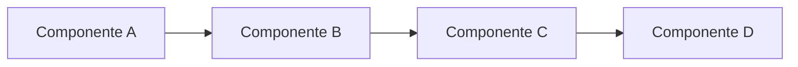

# 🧪 Lab: {Título do Lab}

## 📋 Metadados

| Item | Descrição |
|------|-----------|
| **Nível** | Iniciante / Intermediário / Avançado |
| **Duração estimada** | X minutos |
| **Tecnologias** | {Lista de tecnologias utilizadas} |
| **Versões utilizadas** | {Tecnologia 1: vX.Y.Z, Tecnologia 2: vX.Y.Z} |
| **Última atualização** | {Data} |
| **Autor** | {Nome do autor} |

---

## 🎯 Objetivo

{Descrever claramente o que o aluno vai aprender neste lab. Seja específico e focado no resultado de aprendizado. Use 2-3 parágrafos descrevendo o objetivo geral e os objetivos específicos.}

**Ao final deste lab, você será capaz de:**
- {Resultado de aprendizado 1}
- {Resultado de aprendizado 2}
- {Resultado de aprendizado 3}

---

## 📚 Pré-requisitos

Antes de iniciar este lab, certifique-se de ter:

- [ ] {Pré-requisito 1: software instalado, conhecimento prévio, etc.}
- [ ] {Pré-requisito 2}
- [ ] {Pré-requisito 3}
- [ ] {Pré-requisito 4}

---

## 🏗️ Arquitetura

{Descrever a arquitetura ou o ambiente que será criado/utilizado neste lab. Explicar os componentes e como eles se relacionam.}

### Diagrama da Arquitetura

```
{Diagrama ASCII ou incluir um diagrama mermaid}

Exemplo de diagrama mermaid:

```

### Componentes

- **{Componente 1}**: {Descrição breve do papel deste componente}
- **{Componente 2}**: {Descrição breve do papel deste componente}
- **{Componente 3}**: {Descrição breve do papel deste componente}

---

## 💡 Conceitos Fundamentais

{Esta seção explica os conceitos teóricos necessários antes de começar a prática. Divida em sub-seções conforme necessário.}

### {Conceito 1}

{Explicação clara e didática do conceito. Use analogias se ajudar. Inclua exemplos práticos.}

### {Conceito 2}

{Explicação do segundo conceito fundamental.}

### {Conceito 3}

{Explicação do terceiro conceito, se necessário.}

---

## 🔧 Passo a Passo

### Passo 1: {Nome do Passo}

**Objetivo:** {O que será alcançado neste passo}

**Comandos:**
```bash
{Comandos a serem executados}
```

**Explicação:**
{Explicar o que cada comando faz e por que é necessário. Ser didático e claro.}

**Resultado Esperado:**
```
{Output ou resultado esperado da execução dos comandos}
```

---

### Passo 2: {Nome do Passo}

**Objetivo:** {O que será alcançado neste passo}

**Comandos:**
```bash
{Comandos a serem executados}
```

**Explicação:**
{Explicar o que cada comando faz e por que é necessário.}

**Resultado Esperado:**
```
{Output ou resultado esperado}
```

> 💡 **Dica:** {Dica útil relacionada a este passo}

---

### Passo 3: {Nome do Passo}

**Objetivo:** {O que será alcançado neste passo}

**Comandos:**
```bash
{Comandos a serem executados}
```

**Explicação:**
{Explicar o que cada comando faz e por que é necessário.}

**Resultado Esperado:**
```
{Output ou resultado esperado}
```

> ⚠️ **Atenção:** {Aviso importante sobre possíveis problemas ou cuidados necessários}

---

{Continue adicionando passos conforme necessário, sempre seguindo o mesmo padrão: Objetivo → Comandos → Explicação → Resultado Esperado}

---

## ✅ Validação Final

Para validar que tudo foi configurado corretamente, execute:

```bash
{Comando de validação final}
```

**Resultado esperado:**
```
{Output que confirma o sucesso}
```

Se você obteve este resultado, parabéns! Você completou o lab com sucesso! 🎉

---

## 🧹 Limpeza (Cleanup)

Para evitar custos desnecessários e manter seu ambiente limpo, execute os seguintes comandos para remover todos os recursos criados neste lab:

```bash
{Comando 1 de limpeza}
```

```bash
{Comando 2 de limpeza}
```

```bash
{Comando 3 de limpeza}
```

**Validar a limpeza:**
```bash
{Comando para validar que os recursos foram removidos}
```

---

## 🔍 Troubleshooting

Aqui estão soluções para problemas comuns que você pode encontrar:

| Problema | Causa Provável | Solução |
|----------|----------------|---------|
| {Descrição do problema 1} | {Causa do problema} | {Solução passo a passo} |
| {Descrição do problema 2} | {Causa do problema} | {Solução passo a passo} |
| {Descrição do problema 3} | {Causa do problema} | {Solução passo a passo} |

---

## 📚 Referências

- [{Nome da tecnologia 1} - Documentação Oficial]({URL da documentação oficial})
- [{Nome da tecnologia 2} - Documentação Oficial]({URL da documentação oficial})
- [{Guia/Tutorial relevante}]({URL})
- [{Artigo técnico relevante}]({URL})

---

## 🚀 Próximos Passos

Agora que você completou este lab, aqui estão algumas sugestões de continuidade:

1. **{Lab complementar 1}**: {Breve descrição do que será aprendido}
2. **{Lab complementar 2}**: {Breve descrição do que será aprendido}
3. **{Lab complementar 3}**: {Breve descrição do que será aprendido}

### Sugestões de Aprofundamento

- {Tópico avançado relacionado 1}
- {Tópico avançado relacionado 2}
- {Tópico avançado relacionado 3}

---

**🎓 Parabéns por concluir este lab!** Se você tiver dúvidas ou sugestões de melhoria, sinta-se à vontade para contribuir com o projeto.
